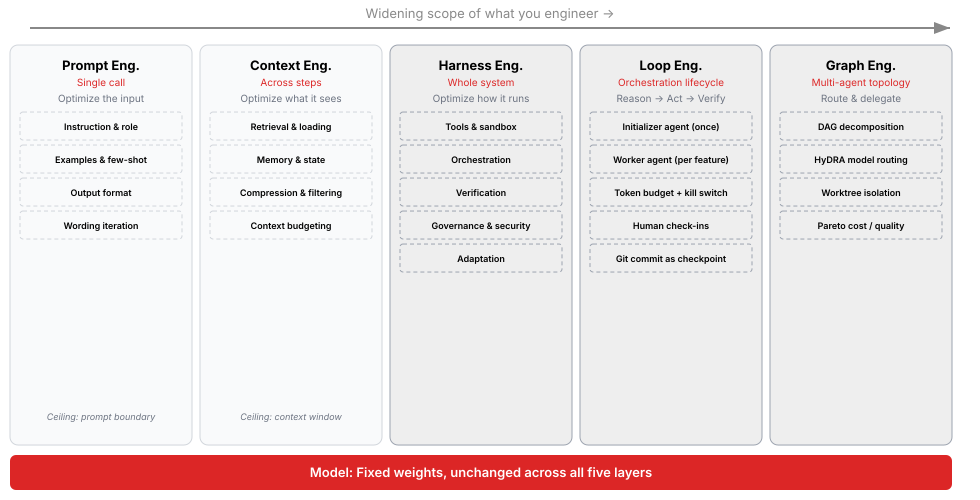
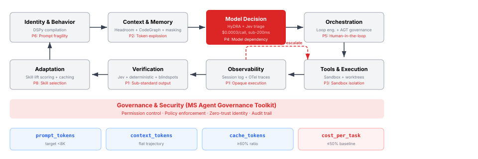

# Frontier HVE

**From AI-generated code to evidence-backed software delivery.**

Frontier HVE is an enterprise AI harness built on GitHub Copilot in VS Code. It engineers the system around the model: the context it sees, the tools it can use, the loops it can repeat, the evidence it must produce, and the decisions that remain human. Five delivery modes connect prompt, context, harness, loop and graph engineering in one inspectable workspace.

**Quality > cost > token efficiency > latency > cache efficiency.** These are the five outcome pillars, distinct from the five engineering layers. Each delivery flow in section 2 maps to these outcomes in section 6.

| Frontier HVE in 60 seconds | What makes it concrete |
|---|---|
| Evidence-backed delivery | A feature passes only after its locked check succeeds and its change is committed |
| Two kinds of graph engineering | Graphify retrieves code relationships; `creator-flow` controls evidence-gated delivery stages |
| Bounded autonomy | Fresh workers, an attempt ledger, deterministic recovery rules, and explicit escalation |
| Skills that earn admission | The SkillOpt-style gate measures paired quality lift and token overhead before loading a skill |
| Inspectable economics | Copilot OpenTelemetry supplies per-call tokens and cost; blind scores and trajectories show what those calls delivered |
| Composable capabilities | Custom agents, hooks, MCP and the opt-in harness-assist plugin extend the existing Copilot runtime |

The proposition is testable: **does the harness produce better verified work for the resources consumed?** A larger agent team, a longer loop, or another plugin is not an improvement until the evidence says so.

The design follows [reference/Enterprise AI Harness Blueprint v3.html](reference/Enterprise%20AI%20Harness%20Blueprint%20v3.html). Sections 1–11 below follow the blueprint; each one says what Frontier HVE implements and where it deliberately differs.

> **Evidence boundary.** Core mechanisms have unit-test coverage; built, partial, optional and deferred capabilities are distinguished below. Items become *validated* only when the user confirms them in [tracker.json](tracker.json). Live runs exist for the three baseline modes; the newer loop, flow and GitHub workflows are not yet validated live. This is not yet proof of production readiness or a measured harness-only advantage.

---

## Install the Frontier HVE extension

| Step | Action |
|---|---|
| 1. Build | `python extension/build.py`, then from `extension/`: `npx --yes @vscode/vsce package --skip-license` (creates `frontier-hve-<version>.vsix`) |
| 2. Install | `code --install-extension extension/frontier-hve-<version>.vsix` (needs GitHub Copilot Chat and Python 3.11+) |
| 3. Set up | Open the project folder, run **Frontier HVE: Set up** from the Command Palette, pick how you prefer to build (no code, low code or pro code), and reload the window |
| 4. Use | In the Chat view (Session Target: Local) pick an **HVE** agent: `HVE creator`, `HVE creator-flow`, `HVE creator-github`, `HVE single` or `HVE minimal` |

Setup renders the HVE agents and skills as an agent plugin in the extension's storage and registers it in `chat.pluginLocations`. Workspace state goes to `<workspace>/.hve/` (profile, budgets, interventions); setup offers to add `.hve/` to `.gitignore`. The Copilot telemetry export is optional and only needed for research metrics (D-032).

## Quick start (research workspace)

| Step | Command or action |
|---|---|
| Check the setup | `bash init.sh` (needs the OTel export pointed at `.hve/runs/copilot-otel.jsonl`, see D-005 and D-032 in the [decision log](research/decisions/decision_log.md)) |
| Run a benchmark | Set the model picker's reasoning effort to the agent's pin, then `python tools/observe/bench.py <minimal\|single\|creator\|creator-flow>`, open a new **Local** chat with that agent, and paste |
| Compare runs | `python tools/observe/compare.py` |
| Inspect one run | `python tools/observe/trajectory.py <session_id>` |
| Prepare blind scoring | `python tools/observe/blind.py prepare` |
| Run all tests | `python tests/test_<name>.py` for each file in [tests/](tests) |

## Agent modes

| Agent | Purpose | Defined in |
|---|---|---|
| `minimal` | Baseline: pinned model, no tools, at most 200 lines inline | [.github/agents/minimal.agent.md](.github/agents/minimal.agent.md) |
| `single` | One agent with file, search and terminal tools | [.github/agents/single.agent.md](.github/agents/single.agent.md) |
| `creator` | Full harness: feature loop, sub-agents, guards, metrics, Graphify, admitted skills | [.github/agents/creator.agent.md](.github/agents/creator.agent.md) |
| `creator-flow` | Graph workflow: Designer → Prototyper → Builder ⇄ Architect → Sweeper → Grower ⇄ Maintainer | [.github/agents/creator-flow.agent.md](.github/agents/creator-flow.agent.md) and six `flow-*` stage agents |
| `creator-github` | Product work: GitHub PRs the user ticks, human-picked parallel options; tick recording and guardrail hooks are wired in the agent | [.github/agents/creator-github.agent.md](.github/agents/creator-github.agent.md) |

The installed extension ships the same five agents with an **HVE** prefix ([extension/agents](extension/agents)), plus `HVE skill-evaluator` for onboarding a user's own skills; they work on the open workspace itself instead of `.hve/outputs/<mode>/current/`, and leave out the research-only metrics and Graphify hooks. They have no model pin and no time budget: they run on the model chosen in the picker, including Auto (D-033).

All agents pin their model in the agent file; `metrics.py flush` rejects a run served by another model. `minimal` and `single` stop hard after 10 minutes. The three creator agents get 15 minutes; then VS Code asks the user to allow the next tool call, and each allowed call adds 15 more minutes (D-030).

**Sub-agents can run on a different model than the session (D-036).** VS Code picks a Local sub-agent's model in this order: a `model` the main agent passes to the sub-agent tool; the custom agent's own `model` property; Auto, if `chat.subagents.defaultToAuto` is on; otherwise the main model ([docs](https://code.visualstudio.com/docs/copilot/agents/subagents#_select-the-model-for-a-subagent)). Built-in helpers carry their own fast model: the Explore sub-agent ran on Claude Haiku 4.5 under a Claude Opus 5.5 session, and run a187413b recorded `gpt-5.6-luna` sub-agent calls under `gpt-5.6-sol`. Requested models above the main model's cost tier are refused. So the reasoning level set for the session does not carry over to every sub-agent: the research flow stage agents pin their model, the HVE product agents inherit the picker's model, and `metrics.py` records each sub-agent call's model separately.

---

## 1. Engineering progression



Each layer widens what is engineered while the model stays fixed. Frontier HVE covers every layer:

| Layer | In Frontier HVE |
|---|---|
| Prompt | Mode prompts in `.agent.md` files; concise rules, definition of done, autonomy and time-budget instructions |
| Context | Typed user memory ([hooks/profile_detector.py](hooks/profile_detector.py)), sub-agent return cap ([hooks/compaction.py](hooks/compaction.py)), explicit tool lists, Graphify code graph |
| Harness | Hooks for budget, guards, metrics, module size and skills; verification gate; OTel metrics |
| Loop | Initializer/worker loop with locked features, git commits as checkpoints, attempt ledger, deterministic retry rules, human escalation |
| Graph | `creator-flow` state machine, parallel options in git worktrees, at most 3 one-role sub-agents |

## 2. Architecture

The blueprint names the Copilot SDK as runtime. Frontier HVE runs on **VS Code Copilot Chat custom agents with Local hooks**: the same agent loop, configured through `.agent.md` files and hook commands, so no orchestration code has to be hosted.

### Delivery flows

| Flow | Route | Intended outcome |
|---|---|---|
| F1: Raw baseline (`minimal`) | Prompt → pinned model → inline artifact → collect and blind-score | Establish what the model delivers without tools or orchestration |
| F2: Tool-assisted baseline (`single`) | Prompt → one agent → file/search/terminal tools → collect and blind-score | Isolate the value and overhead of tools, without delegation |
| F3: Verified feature loop (`creator`) | Feature contract → fresh worker → locked check → commit → next feature or escalate | Turn open-ended generation into incremental, verified delivery |
| F4: Graph workflow (`creator-flow`) | Designer → Prototyper → Builder ⇄ Architect → Sweeper → Grower ⇄ Maintainer | Add design, structural review, cleanup and health gates with capped back-edges |
| F5: Human-controlled delivery (`creator-github`) | Feature loop → verified branches/options → human ticks → selected pushes and PRs | Keep exploration autonomous while release choices remain human |

Each benchmark mode pins its own model and records effort. The existing cross-mode baseline is **not a same-model ablation**; differences cannot be attributed to the harness alone. F5 is product work and is intentionally outside benchmark collection.

### Composition, not another runtime

Cordis's **"everything is a plugin"** philosophy is a design reference: keep capabilities separable rather than embedding every concern in an orchestrator. Here, agent manifests select tools, hooks enforce policy, MCP supplies Graphify, and harness-assist packages reusable workflows. **Cordis itself is not installed**, and its reversible-effect/plugin-lifecycle guarantees are not implemented. The composition uses Copilot's extension surfaces, not a new plugin kernel.

```
.github/agents/            minimal, single, creator, creator-flow, creator-github, flow-* stage agents (research)
extension/                 VS Code extension: HVE agent templates, setup command, build script, plugin renderer
hooks/                     budget, metrics, profile_detector, compaction, graph_refresh, skill_loader,
                           loop_guard, flow_guard, module_guard, no_fallback (git pre-commit), interventions, hve_paths
tools/observe/             bench, collect, compare, blind, trajectory, otel_prune (research only)
tools/loop/                loop (init/next/verify/resume), diagnose (ledger + rules), flow (state machine)
tools/git/                 branch_workflow (PR records, push queue), parallel_options (worktrees)
tools/skills/              scan, triage, eval_skill, onboard
skills/                    categories.json, registry.json, admitted/
plugins/harness-assist/    skills and the choice-recorder and guardrail scripts
.hve/                      workspace state: runs, outputs, blindspots, user_profile.json
research/                  comparisons, findings, blind scoring, decisions, hypothesis
tests/                     prompts, rubric, unit tests
```

Machine state is JSON only (`feature_list.json`, `.hve/user_profile.json`, `.harness/*.json`, JSONL logs). Agent-scoped hooks run only on the Local session target.

## 3. System flow



| Blueprint node | Frontier HVE implementation |
|---|---|
| Identity and behavior | Agent prompts; inferred `explanation_depth` and preferences from [.hve/user_profile.json](.hve/user_profile.json) injected at session start |
| Context and memory | Graphify MCP (creator), compaction hook, profile memory, explicit tool lists |
| Model decision | Pinned model per mode, enforced at flush; reasoning effort recorded per call and checked by the bench (D-020). No dynamic routing |
| Orchestration | Feature loop, `creator-flow` stages, sub-agents capped at 3 |
| Tools and execution | Local tools; git worktrees for parallel options; push gate |
| Observability | Hook events joined with Copilot OTel spans per call; interventions log; trajectory view |
| Verification | Locked shell checks per feature, no-fallback pre-commit scan, module guard, victory check |
| Adaptation | Attempt ledger rules, Phase 9 skill gate with lift scoring |
| Governance | Hooks deny, block, ask or stop deterministically (anti-gaming, hook bypass, unticked pushes, budget) |
| Four metrics | `prompt_tokens`, `context_tokens`, `cache_tokens` / `cache_read_tokens`, `cost_nano_aiu` per call in `.hve/runs/<session>.jsonl` |

## 4. Harness comparison: what is borrowed

The stack takes advantage of existing runtimes and research without treating every promising component as a required dependency. **Integrated** means wired into this repo; **adapted** means a method implemented locally; **optional** means an explicit integration exists but is not active; **deferred** means it is not part of current execution.

| Source | Borrowed | Skipped |
|---|---|---|
| GitHub Copilot | Agent loop, custom agents, Local hooks, MCP, skills, plugins, OTel export | Auto model routing and HydraFusion (pinned models only) |
| Anthropic long-running pattern | Initializer/worker, JSON feature list, progress file, git checkpoints, anti-gaming | Fresh container per trial (no Docker on the managed device) |
| Claude Code | Sub-agent delegation, hooks-and-permissions model | — |
| OpenHands | Worktree isolation for parallel options | Docker sandbox |
| Hermes | Return-size cap for sub-agents as the compaction mechanism | Turn summarization (hooks cannot rewrite history, D-013) |

| Tool or concept | Adoption status | Role in Frontier HVE |
|---|---|---|
| Graphify | Integrated for `creator` | Local AST code graph and MCP retrieval, refreshed as the generated project changes |
| Loop engineering | Adapted | Anthropic-style initializer/worker lifecycle, script-owned state, verified commits and bounded recovery |
| Graph engineering | Implemented locally | An evidence-gated delivery state machine, separate from Graphify's code-knowledge graph |
| Cordis / DeepSeek Harness | Design reference | Composable capabilities; no Cordis dependency or hot-swap/undo claim |
| SkillOpt | Local gate, inspired by the method | Scan → categorize → paired evaluation → admit → selectively load; not an imported SkillOpt runtime |
| SkillsBench / ACES | Method reference | With/without-skill evaluation and small focused skill bundles; not a claim that their benchmark suites run here |
| NVIDIA SkillEvaluator | Optional, not installed | The scanner's `--skillevaluator` integration adds keyless `quality-check`; paired live evaluation uses this repo's bench instead (D-022) |
| HyDRA / OpenRouter Auto | Research references, not integrated | Capability routing is a candidate cost lever; current modes pin models for interpretable measurements |
| HydraFusion | Not enabled | Multi-model orchestration is tracked in research, not advertised as an active capability or a measured saving |

Research rationale and sources: [blueprint](reference/Enterprise%20AI%20Harness%20Blueprint%20v3.md), [research synthesis](reference/archive/compass_artifact_wf-1e846d06-8fd5-5477-a38e-1bc57f83a5cf_text_markdown.md), and [decisions D-015, D-016 and D-022](research/decisions/decision_log.md).

## 5. Anthropic long-running pattern

Implemented in [tools/loop/loop.py](tools/loop/loop.py) and guarded by [hooks/loop_guard.py](hooks/loop_guard.py) (decisions D-023, D-026, D-027):

- **Initializer** (`loop.py init --review local|github`): validates `feature_list.json` (3 or more features, exact fields, non-trivial shell check), locks names, descriptions and checks, writes `progress.txt` and `tracker.json`, and starts git with the no-fallback pre-commit hook (a new repo, or the existing one with its identity and branch kept).
- **Worker** (`loop.py next` / `verify`): one feature at a time on a stacked `feature/<name>` branch, built by a fresh sub-agent. `next` first runs the check and requires it to fail (attempt 0). `verify` runs the locked check, commits, and only then flips `passes` and writes a PR record.
- **Tracker** (`loop.py status`, also refreshed by `next`, `verify` and `resume`): `tracker.json` lists each feature's status, attempts, check, evidence files the check produced in `.harness/evidence/<feature>/` (for example screenshots) and the user's manual check.
- **Anti-gaming**: edits to `feature_list.json`, `progress.txt`, `tracker.json` and `.harness/` are denied except through the loop scripts (blindspot B5); the loop also re-checks the lock.
- **No circular retries**: every failed check is recorded in an attempt ledger and gets one rule-chosen action, then the human:

| Rule | Signal | Action |
|---|---|---|
| R0 | New error | Fix what the check reports |
| R1 | Same error with the same files as an earlier attempt | Ask the human |
| R2 | Same error twice | Fresh sub-agent with a different approach, or parallel options |
| R3 | A tool fails 3+ times or a command repeats | Fixed hint for that tool |
| R4 | Two or more retrieval misses | Code graph and exact paths to a fresh sub-agent |
| R5 | Failure identical to the pre-work baseline | Ask the human (the check is suspect) |
| R6 | Environment error | Registry fix from AGENTS.md, else ask the human |
| R7 | A rule fires a second time | Ask the human |

  After 5 attempts the feature also escalates. Only the human runs `loop.py resume <note>`.
- **Victory check**: a Stop hook keeps the agent working while features fail, until escalation or the end of the budget.

## 6. Five pillars: outcomes, metrics and flow coverage

**Decision priority: quality > cost > token efficiency > latency > cache efficiency.** Quality is the first gate: a cheap or fast result that fails the required checks is not a successful delivery. Cache efficiency remains the fifth pillar from the existing comparison model; it is a supporting diagnostic, not an excuse to replay more context.

### What is measured

| Rank | Pillar | Recorded metrics and evidence | How to interpret it |
|---|---|---|---|
| 1 | Quality | `human_score`, `ai_score`; feature `passes`; locked-check exit codes and optional `HARNESS_CHECKS passed/total`; paired skill lift | Blind human judgment leads, supported by AI scoring and executable checks; a passing narrow check does not prove end-to-end correctness |
| 2 | Cost | Per-call `cost_nano_aiu`; per-run `cost_aiu`; paired skill cost delta | Sum unique model calls, including workers; report Copilot AI units, not invented dollar prices. Cost is recorded, not a currency-based spending cap |
| 3 | Token efficiency | `prompt_tokens`, `completion_tokens`, `context_tokens`; `model_calls`, `tool_calls`, `subagent_calls`; context-growth first/last/peak/ratio; skill token overhead | Compare resources at an acceptable quality level. Actual prompt size per call shows context growth; cumulative `context_tokens` is not a per-call context window |
| 4 | Latency | `wall_clock_s`; per-call timestamps; paired skill latency delta; attempt ledger | Compare end-to-end delivery time and rework, not only model speed. Current benchmark modes have different time budgets |
| 5 | Cache efficiency | `cache_tokens`, `cache_read_tokens`, `cache_ratio` | Ratio = cache-read tokens / prompt tokens. Cache writes are not savings; prompt totals already include cached input |

Evidence comes from [metrics.py](hooks/metrics.py), [compare.py](tools/observe/compare.py), [trajectory.py](tools/observe/trajectory.py), the [feature loop](tools/loop/loop.py), and [paired skill evaluation](tools/skills/eval_skill.py). Aggregates include run counts and standard deviations when multiple runs exist. Hook interventions, error fingerprints, tool success rates and escalation records help explain the outcomes; they are not independent quality scores.

**Policy versus implementation:** the five-pillar order above is the decision policy. The current [comparison sorter](tools/observe/compare.py) still orders human score → AI score → prompt tokens → wall-clock time → cache ratio. It reports cost but does not yet use cost as a ranking key. Per-option token attribution and automated cost-per-success reporting are also not implemented.

### Every delivery flow against every pillar

| Section 2 flow | Quality | Cost | Token efficiency | Latency | Cache efficiency |
|---|---|---|---|---|---|
| F1: `minimal` | Blind-scored artifact; no execution-time verification tools | AI units per run | Prompt/completion totals establish the no-tools baseline | Run wall-clock time | Cache-read ratio measured |
| F2: `single` | Blind scoring plus agent-run checks; no locked feature gate | AI units per run | Tool/model calls and context growth | Wall-clock time; 10-minute budget hook | Cache-read ratio measured |
| F3: `creator` | Locked checks, verified commits, blind scores and escalation | Main + worker calls counted; bounded retries limit opportunities for waste | Graphify, explicit tool lists, fresh workers, 2K-token return instruction, admitted-skill cap | Wall-clock time; 15-minute blocks with user-approved continuation; five-attempt escalation cap | Cache-read ratio measured; no custom cache engine |
| F4: `creator-flow` | F3 checks plus design, architecture, sweep and final-health evidence | Collected like F3; stage overhead must justify itself | Bounded handoffs and stage-relevant context; no separate Graphify hookup | Wall-clock time; 15-minute blocks with user-approved continuation; capped back-edges | Same benchmark accounting as F3 |
| F5: `creator-github` | Verified branches, recorded human option/push choices, PR workflow | No benchmark cost collection; time extensions need user permission | One-role workers and scoped workflows; savings not measured | 15-minute blocks with user-approved continuation; no benchmark latency collection | Not collected by this mode |

Budget hooks act at tool boundaries; they cannot interrupt an already-running command. The creator modes warn two minutes before expiry, then request permission to continue; extensions are recorded as `budget_extended` interventions. Governance spans all five pillars: guarded state, permission checks and human approval protect the experiment and delivery contract, but do not replace OS-level isolation.

### Problems these pillars address

| # | Problem | Frontier HVE |
|---|---|---|
| P1 | Opaque execution, sub-standard output | Built: per-call metrics from OTel, interventions log, [trajectory view](tools/observe/trajectory.py), verification gate |
| P2 | Token explosion, context rot | Built: Graphify, compaction cap, explicit tool lists, context-growth and rot detection. Headroom not adopted (D-015) |
| P3 | Sandbox isolation | Partial: worktrees for options, guarded state, push gate. No Docker or gVisor sandbox |
| P4 | Model dependency and cost | Measured, not routed: cost per call recorded (D-017); models pinned for comparability |
| P5 | Human in the loop | Built: time-budget stop or user-approved extension, retry rules, escalation questions, ticked option choice and PR pushes |
| P6 | Prompt fragility | Partial: typed profile with inferred explanation depth; DSPy/GEPA not used |
| P7 | Sub-agents | Built: at most 3, one role each, under 2K-token returns |
| P8 | Skill selection | Built: Phase 9 gate (scan, provisional static gate, paired eval, lift thresholds, ranked loadout within 10 skills and 2,000 tokens per task) |

### Research tradeoffs: the rabbit holes we avoid

The research contains competing findings, not a universal verdict that loops or multiple agents are bad. These choices are scoped to this harness; external benchmark results and community reports are not Frontier HVE results.

| Approach | Promise and counter-evidence in the research | Current choice |
|---|---|---|
| Ralph-style loop engineering | Fresh context and repetition can help when success is machine-checkable; repetition without an independent verifier can amplify errors and spend | Keep bounded initializer/worker loops, locked checks, attempt fingerprints and escalation; avoid verifier-less or unlimited loops |
| OpenClaw-style always-on agents | Persistent assistants can serve ongoing workflows; reported heartbeat/history costs are workload-specific community anecdotes, not a controlled benchmark | No idle heartbeat or always-on execution; run explicit tasks with visible evidence |
| Multi-agent swarms | Research reports gains on parallel exploration, alongside much higher token use and weaker fit for tightly coupled coding | At most three one-role workers, isolated worktrees where options need them, concise returns; no free-running swarm |
| HydraFusion / model panels | Multiple drafts or models may improve quality; they also complicate attribution, billing and model-policy review | Not enabled; any future routing experiment needs approved models and a separate quality/cost comparison |
| Self-generated skills | Fast adaptation is attractive; SkillsBench findings do not support assuming generated skills outperform a no-skill baseline | Scan and measure paired lift; no automatic self-admission |
| Headroom / blanket context rewriting | Compression may reduce input size; the evaluated integration would affect unrelated VS Code chats and could not be scoped per agent | Not adopted (D-015); use scoped retrieval and bounded worker returns |

See the [blueprint's ranked problems and research review](reference/Enterprise%20AI%20Harness%20Blueprint%20v3.md) and [source-linked research synthesis](reference/archive/compass_artifact_wf-1e846d06-8fd5-5477-a38e-1bc57f83a5cf_text_markdown.md) for supporting and contradictory evidence. Routing remains a candidate for later measurement, not a substitute for improving the harness first.

## 7. Token reduction and code knowledge

**Retrieve relationships, not repeated file dumps.** Graphify gives `creator` a local code-knowledge graph for symbol lookup, neighbors and paths. That is distinct from the delivery graph in `creator-flow`: one supplies context, the other controls transitions. The integration is built; its incremental token and quality benefit still needs an on/off ablation (D-016).

| Tool | Status |
|---|---|
| Graphify | Adopted for creator, code-only and local; the graph refreshes when the project changes ([hooks/graph_refresh.py](hooks/graph_refresh.py), D-016) |
| CodeGraph | Not used; Graphify fills the code-graph role |
| Headroom | Not adopted: it reroutes all Copilot traffic in VS Code and cannot be scoped to one agent (D-015). Notes in [phase-3-tokenomics.md](research/findings/phase-3-tokenomics.md) |
| Observation masking | Via sub-agents with a 2K-token return cap (hooks cannot rewrite history, D-013) |
| Deferred tools | Copilot's native `tool_search` plus explicit per-agent tool lists |
| Caveman | Skipped; a one-line "be concise" rule instead |

## 8. Tooling, skills and governance

**SkillOpt-style admission: skills earn their place in context.** Discovery is not installation, and installation is not evidence of value. Thirteen skills were authored; a micro paired evaluation admitted ten and rejected three (D-022, D-037, D-038; method and results in [research/findings/phase-9-skill-micro-eval.md](research/findings/phase-9-skill-micro-eval.md)). NVIDIA SkillEvaluator is an optional scanner integration, not a currently running dependency.

- **Skill gate (Phase 9, D-022, D-037)**: [scan.py](tools/skills/scan.py) blocks malformed or unsafe skills (prompt injection, external fetches, encoded payloads, destructive commands, secrets); [triage.py](tools/skills/triage.py) maps candidates to the selected categories ([skills/categories.json](skills/categories.json)); [onboard.py](tools/skills/onboard.py) `--provisional` admits a skill that passes the scan, matches a category, stays under 800 tokens and a 200-character description and ships no non-Python scripts; [eval_skill.py](tools/skills/eval_skill.py) runs paired with/without benchmarks of full sessions, [micro_eval.py](tools/skills/micro_eval.py) runs a fast micro version (below), and [onboard.py](tools/skills/onboard.py) without the flag promotes a skill to `admitted` at a lift of 10 or more points with token overhead under 20% (micro evals also need wins or ties on 3 of 5 tasks and no task lost by more than 1 point).
- **Micro paired evaluation (D-038)**: each skill has 5 small tasks with 3-4 checks each ([tests/skill_tasks](tests/skill_tasks)). One tool-less call of `gpt-5.4-mini` answers each task with the skill in its instructions and once without; `gpt-5.2-chat` judges every pair blind (A/B order fixed by a hash of the task id) against the checks, scoring 0-5. Both answers come from the same model, so judge self-preference does not favour either condition. Token overhead is the extra prompt and answer tokens divided by a typical creator call (50K tokens). Keyless Entra auth through the Azure CLI; every response is cached in `.hve/evals/micro/`, so re-runs and resumes are free. The full run for 13 skills took 144 s and about 140K tokens.

| Skill | Lift (pp) | Wins/ties/losses | Result |
|---|---|---|---|
| `dreams` | 56 | 5/0/0 | admitted |
| `analyst` | 44 | 4/1/0 | admitted |
| `scrub` | 40 | 4/1/0 | admitted |
| `build-approach` | 28 | 4/1/0 | admitted |
| `ux-flows` | 28 | 5/0/0 | admitted |
| `web-research` | 28 | 3/2/0 | admitted |
| `prose-anti-slop` | 28 | 2/2/1 | admitted (ties count as wins) |
| `api-design` | 16 | 3/2/0 | admitted |
| `architecture-options` | 12 | 3/2/0 | admitted |
| `ui-anti-slop` | 12 | 2/3/0 | admitted (ties count as wins) |
| `code-hygiene` | 8 | 2/1/2 | rejected |
| `ui-content` | 4 | 2/1/2 | rejected |
| `accessibility` | 0 | 1/3/1 | rejected |
- **Skill library and budgeted loading (D-037)**: library skills ([skills/admitted](skills/admitted), registry [skills/registry.json](skills/registry.json)) are not discoverable, so they add nothing to ordinary chats. In creator sessions [hooks/skill_loader.py](hooks/skill_loader.py) ranks them per prompt with [recommend.py](tools/skills/recommend.py) (admitted first, then relevance to the prompt, measured lift, size), loads as many as fit the loadout budget (up to 10 skills and 2,000 tokens) by copying them to `.hve/skills/`, offers the rest ranked so the user can tick more (ask-questions `load-skills`), and denies reading any other library skill. Plugin skills stay readable. `/recommend-skills` shows the same ranking on demand with the evidence: [SkillsBench](https://www.skillsbench.ai) (arXiv 2602.12670) found curated skills raise pass rates by 16.6 points on average and that focused skills beat exhaustive bundles. HVE agents load `provisional` and `admitted` skills; research agents load `admitted` only.

| Category | Library skills (admitted) |
|---|---|
| UX | `ux-flows`, `ui-anti-slop` |
| Architecture | `architecture-options`, `api-design`, `build-approach` (no code, low code or pro code) |
| De-slop | `ui-anti-slop`, `prose-anti-slop` (`code-hygiene` rejected) |
| Scrub | `scrub` |
| Dreams / self-learning | `dreams` (lessons learned into `.hve/learnings.json`) |
| Research | `web-research`, `analyst` |

  The skills are original text; their topics and several ideas were informed by the skill library of [AgentX](https://github.com/jnPiyush/AgentX) (Apache-2.0) and the projects its NOTICE credits. See [skills/authored/NOTICE](skills/authored/NOTICE).
- **Skill evaluator for extension users (D-039)**: pick the `HVE skill-evaluator` agent and give it a skill folder. It runs the static gate ([evaluate.py](tools/skills/evaluate.py) `static`), drafts 5 tasks for the user to approve, gets with/without answers from a tool-less `HVE skill-worker` sub-agent (or from Foundry when `.env.local` is set), has a separate `HVE skill-judge` sub-agent score blind pairs, and applies the same admission rule. Admitted skills go to the workspace library (`.hve/skill-library/`, `.hve/skills-registry.json`) and load per task like the harness library, never into every chat.
- **Context-load guardrail (D-039)**: [context_load.py](tools/skills/context_load.py) measures what loads into every request before the user types: every discoverable skill (workspace, user and plugin folders), always-on instructions (`copilot-instructions.md`, `AGENTS.md`, `*.instructions.md` with `applyTo: **`), the agent prompt and an estimate per MCP server. It reports the total, its share of the context window, the top contributors, duplicate and never-measured skills, and warns when the load grows noticeably or takes a large share of the window, with fixes. No fixed token limit. It runs on demand as `/check-context-load`, at **Frontier HVE: Set up** (notification), at the delivery-coach close-out, and at the end of a skill evaluation. Details and invocation: [research/findings/phase-9-skill-evaluator-and-context-load.md](research/findings/phase-9-skill-evaluator-and-context-load.md).
- **harness-assist plugin (D-029)**: [plugins/harness-assist](plugins/harness-assist) adds the skills `delivery-coach`, `recommend-skills`, `check-context-load`, `feature-checklist`, `run-tests`, `code-review`, `parallel-options`, `pr-push`, `explain-walkthrough` and `prototype-guardrail`, plus two hook scripts wired into the creator agents. The choice recorder turns the user's ticks in ask-questions answers into files the harness enforces. The prototype guardrail flags code over 5,000 lines, files over 20 MB, non-enterprise components (for example FalkorDB, Tesseract, SQLite, local vector stores) with their licensed Azure alternative, and self-built infrastructure, and names the experts to involve. The extension ships these skills; in this repository enable them with the `chat.pluginLocations` setting.
- **Explanation depth (D-034)**: the user is never asked how technical they are. Setup asks only how they prefer to build (no code, low code, pro code) as a starting point; the profile then infers `guided`, `balanced` or `expert` from role statements and how prompts are written, so a stated preference can be outweighed by behavior. Agents adapt silently and never label the user.
- **delivery-coach: protection against vibe-coded production apps (D-035)**: once setup records a build preference, the HVE creator agents run every request as a participatory, verified loop. *Initializer*: `feature_list.json`, `tracker.json` and `progress.txt`. *Generator*: one fresh sub-agent per feature. *Evaluator*: the locked unit-test check, a screenshot captured by the check itself for UI features, and a second sub-agent reviewing the diff and screenshot. After each passing feature the user is offered a manual check (`looks right`, `needs changes`, `skip`), recorded by a hook into the tracker. Complex features get a discovery sprint: 2-3 approaches on their own branches and worktrees under `.hve/discovery/`, each built, run and reviewed before the user ticks the winner. For guided and balanced users the skill coaches first (`explain-walkthrough`) and challenges choices that need an enterprise stack or experts (`prototype-guardrail`), so non-experts are not left scaling a prototype without the right stack or design knowledge.
- **Governance**: enforced by local hooks instead of the Microsoft Agent Governance Toolkit: budget stop or user-approved continuation, anti-gaming, git-hook bypass, human-only commands, force-push ban, and pushes or PRs only for branches the user ticked (D-026).
- **Guardrails (D-025)**: [module_guard.py](hooks/module_guard.py) blocks files over 500 lines; [no_fallback.py](hooks/no_fallback.py) rejects commits that hide errors or ship TODOs.

## 9. Personas, test suite and metrics

The blueprint's three suites (Minecraft builder, FinCon, OpenHands) are not built yet. Frontier HVE benchmarks one task: the colour-palette web app in [tests/prompts/color-palette.md](tests/prompts/color-palette.md), scored against a 15-check [rubric](tests/prompts/color-palette.rubric.json).

| Protocol step | Implementation |
|---|---|
| Pinned model and effort | Agent file pin; flush and bench reject mismatches |
| Run | [bench.py](tools/observe/bench.py) follows a run live and stops waiting at a timeout |
| Collect | [collect.py](tools/observe/collect.py) verifies the prompt and moves output to `.hve/outputs/<mode>/<session>/` |
| Score | [blind.py](tools/observe/blind.py) shuffles runs for human and AI scoring from screenshots |
| Compare | [compare.py](tools/observe/compare.py) reports all five pillars' run metrics into [research/comparisons/](research/comparisons); its legacy sorter has not yet added cost to the priority order (section 6) |
| Cache accounting | `cache_ratio` counts cache reads only (D-020) |

Baseline, one run per mode (details in [phase-2-baseline-blind-eval.md](research/findings/phase-2-baseline-blind-eval.md)):

| Mode | Model / effort | Human score | AI score | Prompt tokens | Cache ratio | Cost (AI units) |
|---|---|---|---|---|---|---|
| creator | gpt-5.6-sol / high | 3.8 | 4 | 629,904 | 0.93 | 75.85 |
| single | claude-opus-5.5 / high | 2.9 | 4 | 645,314 | 0.89 | 110.80 |
| minimal | gpt-6-astra / medium | 0 | 1 | 13,718 | 0.00 | 76.36 |

**What this shows:** in this one-task sample, creator had the highest human score and lowest recorded AI-unit cost. **What it does not show:** a causal harness advantage, a repeatable saving, or a result for the newer workflows. Models and reasoning effort differed, there is only one run per mode, and the baseline creator did not use sub-agents. Same-model, same-effort repeated runs and component ablations are still needed.

## 10. Blindspot detection

| Blindspot | Frontier HVE |
|---|---|
| B1 Fallback code | Built: AST and regex scan as git pre-commit hook; hook bypass denied |
| B2 Done without end-to-end check | Partial: a feature flips only after its locked check passes; no browser-test requirement yet |
| B3 Tests test the mock | Not built |
| B4 Context rot | Built offline: tool-success drop detector in the trajectory view; no live compaction trigger |
| B5 Victory declared early | Built: Stop hook victory check, locked feature list, flip only after commit |
| B6 Permission escalation | Partial: protected loop state and push gate; no sandbox audit |
| B7 Idle loop burn | Built: attempt ledger rules, 5-attempt cap, time budget (continue prompt or hard stop) |
| B8 Skill injection | Built: skill security scan before admission |
| B9 Sub-agent leakage | Built: 2K-token return instruction at sub-agent start |
| B10 DSPy over-optimization | Not applicable (DSPy not used) |

Blindspot-coded interventions are logged to [.hve/blindspots/](.hve/blindspots).

## 11. Research adoption

Frontier HVE's distinctive combination is **two graphs, evidence-gated loops, measured skill admission, and human-controlled release choices**, built around an existing runtime. These are engineering choices to evaluate, not claims of new algorithms or guaranteed savings.

- **Integrated or implemented:** Copilot custom agents/hooks/MCP/OTel, Graphify for creator, the Anthropic-style feature loop, deterministic recovery, bounded graph workflows, blind comparison tooling and human-ticked push gates.
- **Methods adapted:** focused worker context and return caps, SkillsBench/ACES paired evaluation ideas, a local SkillOpt-style gate, and cache-read accounting. The worker return cap is an instruction, not history rewriting or a hard output truncator.
- **Available but inactive:** NVIDIA SkillEvaluator's optional static `quality-check` integration. External skill imports and live paired lift results remain pending.
- **Design references or deferred:** Cordis composition; HyDRA, OpenRouter Auto and Jev routing; HydraFusion panels; DSPy/GEPA; Microsoft Agent Governance Toolkit; Headroom and CodeGraph. None should be read as an active dependency here.

The full source trail is in the [blueprint](reference/Enterprise%20AI%20Harness%20Blueprint%20v3.md), [implementation plan](reference/Implementation%20Plan%20Enterprise%20AI%20Harness%20v3.md), and [decision log](research/decisions/decision_log.md).

---

## Learn more

| Topic | Where |
|---|---|
| Every design decision with evidence (D-001 onwards) | [research/decisions/decision_log.md](research/decisions/decision_log.md) |
| Hypotheses and their status | [research/hypothesis.md](research/hypothesis.md) |
| Findings per phase | [research/findings/](research/findings) |
| Run data: per-call metrics, hook events, run manifests, interventions | [.hve/runs/](.hve/runs) |
| Mode comparison tables | [research/comparisons/](research/comparisons) |
| Blind scoring rounds | [research/blind/](research/blind) |
| Collected run outputs | [.hve/outputs/](.hve/outputs) |
| Phase status, next actions, what is validated | [tracker.json](tracker.json) |
| Original request and design rules | [reference/initial_request.md](reference/initial_request.md) |

### Tests

| Test | Covers |
|---|---|
| [tests/test_metrics.py](tests/test_metrics.py) | Hook and OTel join, token, cache, cost and effort fields, model pin |
| [tests/test_collect.py](tests/test_collect.py) | Run collection and prompt verification |
| [tests/test_hooks.py](tests/test_hooks.py) | Profile memory and inferred explanation depth, compaction, graph refresh, budget |
| [tests/test_skills.py](tests/test_skills.py) | Skill scan, triage, onboarding thresholds, provisional gate, lift report, ranked loadout within budget, offer and tick, scoped denies |
| [tests/test_trajectory.py](tests/test_trajectory.py) | Context-rot detector and context growth |
| [tests/test_loop.py](tests/test_loop.py) | Feature loop, rules R0–R7, guards, push gate, no-fallback scan, module guard, parallel options |
| [tests/test_flow_plugin.py](tests/test_flow_plugin.py) | `creator-flow` edges, evidence and caps, stage guard, choice recorder, prototype guardrail, plugin skill scan |
| [tests/test_extension.py](tests/test_extension.py) | Extension build, plugin rendering, and the rendered HVE agents' hooks and loop tools run from a temp workspace |
